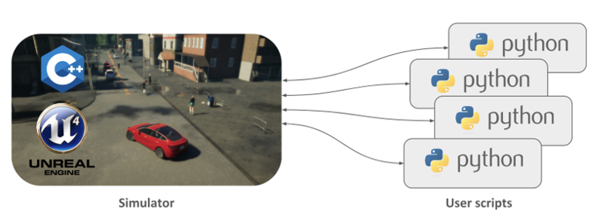
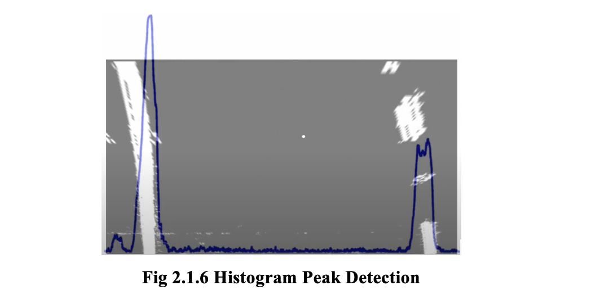
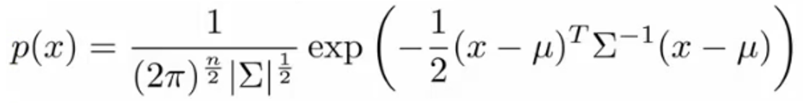

# DRIVER ANOMALY DETECTION SYSTEM

## Introduction
Our proposed system is a blend of two innovative technologies  Machine Learning (ML) and Internet Of Things (IOT). The IOT part forms a wireless sensor network (WSN) through the use of  Onboard Diagnostics(OBD) and the ML part reads and analyzes the data stream from the WSN. The analyzed data is used for training the model to learn the driving behavior. Once the model is trained it runs in surveillance model and observes the driver. If there is any abnormal deviation in sensor readings recorded in training mode then it immediately detects it in real time and takes the necessary steps

The WSN of Driver Anomaly System takes 6 major inputs:
| Input              | Proportional To              | Range        | Interpretation                    |
|--------------------|------------------------------|--------------|-----------------------------------|
| % Throttle         | Accelerator pedal applied    | 0 to 1       | 0 : No accelerator, 1 : Full accelerator |
| % Brake            | Brake pedal applied          | 0 to 1       | 0 : No brake, 1 : Full brake     |
| Steer Orientation  | Rotation of Steering wheel   | -1 to 1      | -1 : Full Left, 0 : Straight, 1 : Full Right |
| Eye Tracking       | No. of frames for which Eyes| -1, 0, 1    | -1 : No eye in frame, 0 : Eyes are opened, 1 : Eyes are closed |
| Lane Detection     | No. of Lanes the driver invades | +ve integers | Count increments each time a lane is cut |
| Speed              | Velocity in forward direction| Speed in Kmph| Speedometer Reading               |

These readings are fed to a ML based Anomaly Detection Model. Whenever an anomaly is found in these readings the model is capable of detecting it. However it needs to be taught what kind of readings are expected to be normal

## Simulation Setup

**CARLA SIMULATOR**

• CARLA is an open-source autonomous driving simulator. To do so, the simulator has to meet the requirements of different use cases within the general problem of driving (e.g. learning driving policies, training perception algorithms, etc.).

• CARLA is grounded on Unreal Engine to run the simulation and uses the OpenDRIVE standard (1.4 as today) to define roads and urban settings. Control over the simulation is granted through an API handled in Python and C++ that is constantly growing as the project does.

• The CARLA simulator consists of a scalable client-server architecture.
The server is responsible of everything related with the simulation itself: sensor rendering, computation of physics, updates on the world-state and its actors and much more.

• As it aims for realistic results, the best fit would be running the server with a dedicated GPU, especially when dealing with machine learning.
The client side consists of a sum of client modules controlling the logic of actors on scene and setting world conditions. This is achieved by leveraging the CARLA API (in Python or C++), a layer that mediates between server and client that is constantly evolving to provide new functionalities.


CARLA Client Server Architecture

**Features of CARLA:**

It has 7 different types of maps :
1. Areas: Rural and urban,
2. Road Ways: Four lane , six lane and eight lane highways and Ghats.
3. Intersections: junction and round abouts.
4. Variable weather and lighting conditions
5. Control over traffic and pedestrians via NPCs (Non-Playable Characters)
6. Auto Pilot can be used to replicate ideal driving behavior to train the model.
7. Carla provides all kinds of cars from sedans to SUVs and from trucks tempos to ambulances. Each car has different mechanics.

These features provide a wide range of variable conditions for the model to train and thereby reducing chances of under fitting the model.

### Simulation of Front Camera

In Carla there the API provides function to plant a camera at any desired location on the car. The camera moves with the change in position of the car. 
The following code attaches a front mounted camera to the car:

```python
# Set up the sensors.
if preview:
    cam_bp = self world.get_blueprint_library() find("sensor.camera.rgb") #load blueprint of RGB Camera
    cam_bp. set_ _attribute("image_size_x",f"{w}")
    #Set width of frame captured by camera
    cam_bp set_attribute("image_size_y",f"{h}")
    #Set Height of frame captured by camera
    cam_bp set_attribute("fov", "100") # Set the field of view
    spawn_point = carla. Transform(carla.Location (x=2.5,z=2.5))
    #Relative coordinates of mounting point wrt Car
    sensor = self.world. spawn_actor (cam_bp, spawn_point, attach_to=self•player) # Attach to the carl
```

In real world the lane detector will take the input from the front mounted camera as a digital stream of frames. In the simulated environment the above camera will render the required frames. These frames can then be forwarded to the lane detection algorithm.

## Design


As shown in the above diagram, the CARLA simulator has Client-Server Architecture wherein the server is a Unreal Engine 4 Executable. The server creates and controls the environment map and the NPCs (Non Playable Characters). The car we create is spawned in the environment created by the server. 

This car can be controlled and queried using python client API. These are the steps to simulate the car:

1. Connect to the CARLA server using the connector

    ````python
    world = None
    if connect==True:
        client = carla. Client(args.host, args. port)
        client.set_timeout (2.0)
        connect=False
    ````
2. Creating the Client accessible car.
    i. Load the blueprint of the required car from the blueprint library available in the CARLA package.
   
   ii. Configure the attributes (eg. Color) of the blueprint and set the spawning location.
   
    iii. Attach the required cameras and sensors (blueprints also available in blueprint library) at the desired location in the car.
  
   iv. Create the Pygame interface to access the TPP(Third Person Perspective) camera of the car and control the car using keyboard or joystick control.
  
   v. Feed the footage of Cam 0 (Front Mounted Camera) to the Lane detector and footage of Cam 1 (Web Cam ) to the eye detector.
  
   vi. Data collected by the sensors to the detection model periodically.

## Real World Version

### Real – Life Dataflow Model

1. All the readings mentioned in Table 1.0 are captured by WSN(Wireless Sensor Network). These need to be forwarded to the Raspberry Pi for anomaly detection.
2. Readings are taken by sensors 1,2,3 and 4 pre-installed in the car and are accessible through the OBD.
3. The ELM 327 Bluetooth adapter sends the data from OBD to the Raspberry Pi. 
4. The front and dashboard mounted Pi camera footage is sent to the lane detector and eye detector respectively.
5. The Raspberry Pi processes these frames and along with the data from Bluetooth adapter sends the data to the Machine Learning Model.

### SETTING OF THE OBD ADAPTOR (ELM 327)

Connecting the bluetooth adapter to the port, a light immediately illuminates on the adapter. This is because the OBD port has an "always on" 12v output. That means that the bluetooth adapter will be powered and active at all times, even when you're not in the car.


With the bluetooth adapter in place, we  now connect The Raspberry Pi to it. Models above Raspberry Pi 3 B+ have bluetooth built in, so they don't need any other adapters. Just power on the pi, open up a terminal and launch the bluetooth controller.

```bash
bluetoothctl
```

Within the controller, you want to enter these commands in order (minus the # comments)
```bash
power on      # ensures bluetooth is on
power on      # ensures bluetooth is enabled
agent on      # makes pairing persistent
default-agent
scan on       # scans for bluetooth devices
              # the OBDII adapter should read something
              # like this - 00:00:00:00:00:00 Name: OBDII
              # If it asks for a pin, the default pin is 1234
scan off      #turn off scanning once your adapter has been found
pair <adapter mac address>       #pair to your adapters mac address
trust <adapter mac address>      #keeps pairing even after reboot
quit                             #exits out of bluetoothctl
```

The adapter should now be connected and you should be back to your main terminal line. Since the OBD port is a serial port, before we can start talking to it, we need to bind it to a serial port on the Pi.

Just put in the adapter MAC address in the specified location

```bash
sudo rfcomm bind rfcomm0 <adapter mac address>
sudo apt-get install screen
screen /dev/rfcomm0
```

You should be presented with a blank screen. At this point we can start typing our commands. The first few commands are standard for setting up communications. Type each command (minus the # comments) and press enter. To find out more about these commands, you can visit this website.

```bash
atz       #resets the device and returns the device ID
atl1      #enables line feeds
ath0      #disables headers (ath1 enables)
atsp0     #automatically determines communication method
```

With that done, the next command tells the port what information we want to extract. The command consists of two hex values. The first set tells what mode we want to set.

**IMPORTANT:** To get the Bluetooth adapter to connect automatically, there are a couple of extra steps that you need to take with the Raspberry Pi. The first is to edit rc.local

``` bash
sudo nano /etc/rc.local
```

and add the following line before "exit 0"

``` bash
rfcomm bind rfcomm99 <adapter mac address>
```
Where "adapter mac address" is the mac address of your bluetooth adapter.

Finally, you will need to edit the bluetooth config file:
```bash
sudo nano /etc/systemd/system/dbus-org.bluez.service 
```
Find the line that says "ExecStart=/usr/lib/bluetooth/bluetoothd", and change it to this:
```bash
ExecStart=/usr/lib/bluetooth/bluetoothd -C
ExecStartPost=/usr/bin/sdptool add SP
pip install obd pyserial 
```

There are two libraries in python ie. The process of interfacing with OBD. Run the following commands to install:
```bash
pip install obd pyserial
```

This is a sample code to get data from OBD (RPM):
```python
#import required libraries
import obd

#establish a connection with the OBD device
connection = obd.OBD()

#create a command variable
c = obd.commands.RPM

#query the command and store the response
response = connection.query(c)

#print the response value
print(response.value)

#close the connection
connection.close()
```

In the simulated version the following code retrieves sensor data from the car. These functions are inbuilt in CARLA library.

```python
v = world.player.get_velocity()
c = world.player.get_control()
('Throttle:', c.throttle, 0.0, 1.0),
('Steer:', c.steer, -1.0, 1.0),
('Brake:', c.brake, 0.0, 1.0),
```

In real world version these functions need to be replaced by the functions below(functions present in OBD library):
```python
 def get_speed(s):
	global speed
	if not s.is_null():
		#speed = int(s.value.magnitude) #for kph
		speed = int(s.value.magnitude * .060934) #for mph
connection.watch(obd.commands.SPEED, callback=get_speed)
connection.start()
```

This example will retrieve only speed however we need throttle, speed and steering angle. Functions to retrieve them ae also available in OBD.command and the library also supports the use of custom commands to retrieve and interpret the data that is non standard. To learn more follow this link:  OBD Documentation.

## Lane Detection
 The algorithm will detect the lane and mark the lanes and return the frame for us to preview its performance. To see the preview we need to set the global variable Preview = True. By default we have set it to false to reduce GPU consumption. Otherwise the frame drop is very high on weaker GPUs due to inefficiency of Carla program. 

# Mode Selection Variables
```python
h=300
w=300
preview=False # If set to true will display simulation of Lane Detector
joystick=True # If set to True will enable Console Controller input, If False enables keyboard control 
eye_tracker=False
```

Working:
The lane detector employs the method used by Ross Kippenbrock. The following steps are taken:
1. Apply Yellow and White Color filter.
2. Apply Canny Filter and combine it with output of step1.


3. Select 4 point on the image and apply a Warp perspective to get a bird’s eye view of the image


4. Apply Histogram peak detection algorithm to find out where the lane line start.



5.  Once we find the starting point of the lanes we create virtual boxes and sum the pixels in this area to find the deviation of the lane lanes from the center. Using this method we can follow the lane lines. Once the lane is detected we can then find its center and calculate the car’s deviation from the center. If the car deviates to much and then invades into another lane the detector will catch the new lane and there will be a shift in parameters. This shift can be classifies as a lane invasion.


Output of the Lane detector when during runtime:


The lane detector sees the output of the front camera of the car and processes it to see the lane. In preview mode you can see the lane detector mark the detected lane with yellow area. Using this detector we can now compute the rate at which the driver is invading the lanes. It is also possible that there might not be any lanes on the road. In this case there the rate of invasion will be zero and that is normal. In such situations the readings of the steering monitor will be considered.

## Eye Detection

To build our eye detector, we’ll be computing a metric called the eye aspect ratio (EAR), introduced by Soukupová and Čech in their 2016 paper, Real-Time Eye Blink Detection Using Facial Landmarks.

1. The eye aspect ratio is instead a much more elegant solution that involves a very simple calculation based on the ratio of distances between facial landmarks of the eyes.This method for eye blink detection is fast, efficient, and easy to implement.
2. We use Python, OpenCV, and dlib code to:
3. Perform facial landmark detection and 
4. Detect blinks in video streams
5. We can apply facial landmark detection to localize important regions of the face, including eyes, eyebrows, nose, ears, and mouth. This also implies that we can extract specific facial structures by knowing the indexes of the particular face parts
6. Each eye is represented by 6 (x, y)-coordinates, starting at the left-corner of the eye (as if you were looking at the person), and then working clockwise around the remainder of the region:

    

7. There is a relation between the width and the height of these coordinates.Based on the work by Soukupová and Čech in their 2016 paper, Real-Time Eye Blink Detection using Facial Landmarks, we can then derive an equation that reflects this relation called the eye aspect ratio (EAR):

    

8. The eye aspect ratio is approximately constant while the eye is open, but will rapidly fall to zero when a blink is taking place.
9. Using this simple equation, we can avoid image processing techniques and simply rely on the ratio of eye landmark distances to determine if a person is blinking.

    To make this more clear, consider the following figure from Soukupová and Čech:

    

10. The algorithm uses this change to detect closed eyes. 

11. In Real-World scenario the dashboard mounted camera footage will be fed to the detector but in this version we just use the web cam of the user.

14. In the code a global variable is set named as eye_tracker. If this variable is set to True it will set the output of eye tracker on the screen. If it is set to False the eyetracker will run in background without any graphical display.

    ```python
    h=300
    w=300
    preview=False
    # If set to true will display simulation of Lane Detector
    joystick=False
    # If set to True will enable Console Controller input, If False enables keyboard control
    eye_tracker=true
    #If set to True will display output of eye tracker on screen.
    #If False eyetracker will run in background without any graphical display

    ```

## ANOMALY DETECTION MODEL

For Anomaly detection we cannot directly input the raw features as no sensor reading by itself is anomalous in this scenario. For example, if a model while training learns that a speed of 20 – 80 is normal but anything else is abnormal, such a deduction is incorrect as different drivers may drive at different speed ranges. Similarly steering between 30 degrees left and 30 degrees right maybe a trend on a highway or city area. However, in certain conditions we need to take full left or full right. Hence the absolute value of any sensor reading cannot be flagged as an anomaly. Therefore we need to use a change in the value over a time interval as an input feature. The diagram below shows how we extract these features.


### Feature Engineering

## How Anomaly Detection Works?

- Anomaly detection is a reasonably commonly used type of machine learning application
  - Can be thought of as a solution to an unsupervised learning problem
  - But, has aspects of supervised learning

### Example of anomaly detection?

- Imagine you're an aircraft engine manufacturer
- As engines roll off your assembly line you're doing QA
  - Measure some features from engines (e.g., heat generated and vibration)
- You now have a dataset of x1 to xm (i.e., m engines were tested)
- Say we plot that dataset 
    
  - Next day you have a new engine
  - An anomaly detection method is used to see if the new engine is anomalous (when compared to the previous engines)
  - If the new engine looks like the ones we've seen before: 
    - Probably OK - looks like the ones we've seen before
    
  - But if the engine looks like an anomalous data-point: 
    - Uh oh! - this looks like an anomalous data-point
    

### Multivariate Gaussian distribution

- Is a slightly different technique which can sometimes catch some anomalies which non-multivariate Gaussian distribution anomaly detection fails to
  - Unlabeled data looks like this 
    
  - Say you can fit a Gaussian distribution to CPU load and memory use
  - Let's say in the test set we have an example which looks like an anomaly (e.g., x1 = 0.4, x2 = 1.5)
    - Looks like most of the data lies in a region far away from this example
    - Here memory use is high and CPU load is low (if we plot x1 vs. x2 our green example looks miles away from the others) 
  - Problem is, if we look at each feature individually they may fall within acceptable limits - the issue is we know we shouldn't get those kinds of values together
    
    - But individually, they're both acceptable
  - This is because our function makes probability prediction in concentric circles around the means of both
    
    - Probability of the two red circled examples is basically the same, even though we can clearly see the green one as an outlier. Doesn't understand the meaning.

### Applying multivariate Gaussian distribution to anomaly detection

- Saw some examples of the kinds of distributions you can model
- Now let's take those ideas and look at applying them to different anomaly detection algorithms
- As mentioned, multivariate Gaussian modeling uses the following equation 
    

- Which comes with the parameters μ and Σ
  - Where 
    - μ - the mean (n-dimensional vector)
    - Σ - covariance matrix ([nxn] matrix)

### Anomaly detection algorithm with multivariate Gaussian distribution

1. **Fit model** - take dataset and calculate μ and Σ using the formula above
2. We're next given a new example (xtest) - see below
    
   - For it compute p(x) using the following formula for multivariate distribution
   

3. Compare the value with ε (threshold probability value)

- if p(xtest) < ε --> flag this as an anomaly
- if p(xtest) >= ε --> this is OK


- If you fit a multivariate Gaussian model to our data we build this


- Which means it's likely to identify the green value as anomalous

## Engineered Features

| Feature            | Interpretation                       | Balanced Factor | Reset Timer |
|--------------------|--------------------------------------|-----------------|-------------|
| DThrottle          | Change in accelerator applied        | 1x              | 500ms       |
| DBrake             | Change in brake applied              | 1x              | 500ms       |
| DSpeed             | Change in Speed of Vehicle           | 1x              | 500ms       |
| Speed              | Instantaneous Speed of Vehicle       | 1x              | 500ms       |
| Lane Invades       | No. of times Lane is cut             | 0.25x           | 10s         |
| Drowsy Eye Count   | No. of frames for which eyes were closed | 0.5x        | 10s         |
| DSteer             | Change is steering rotation          | 1x              | 500ms       |

**Note:** The time interval between writing two records to the file is 500ms for all. This is because the processor is very fast and completes one iteration in a very small time. Hence it will write to the file at a very high rate if we write once per iteration. For example, in the simulated version if the game runs for 15 fps it will write one record in 1/15th of a second. Hence it will have 15 records in one sec that will lead to a lot of redundancy. To avoid this we only write 2 times per second at an interval of 500ms.

## Model Training

To train the model we have created the train.py python script. This program uses the above feature engineering process to write the data from the sensors to a data.csv.


In order to teach the model what kind of driving is normal or ideal driving behavior we need to fed it wit corresponding inputs. The train.py file fires up a pygame interface which allows you to train the model. You are given a car and you have full control over it. The way you drive in training mode will be recorded as normal driving behavior. You  have two options to drive the car:

